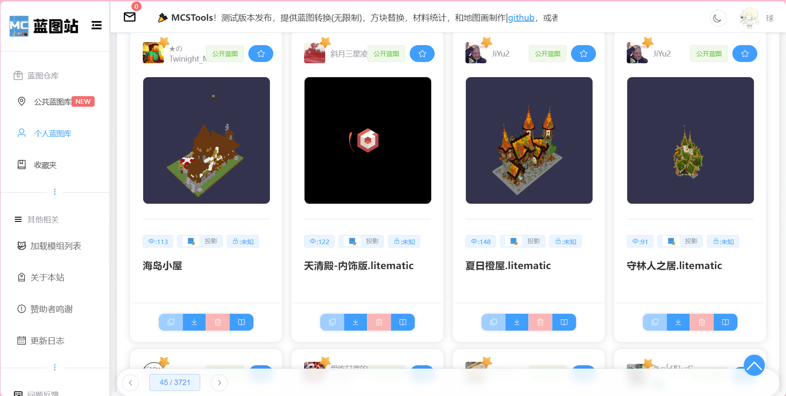
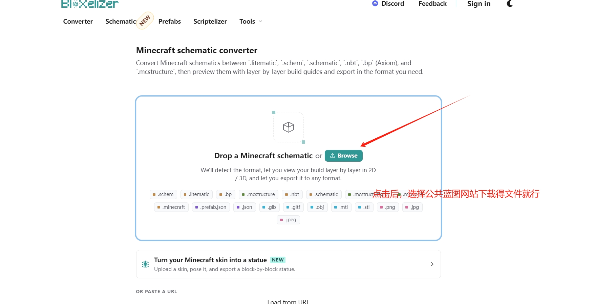
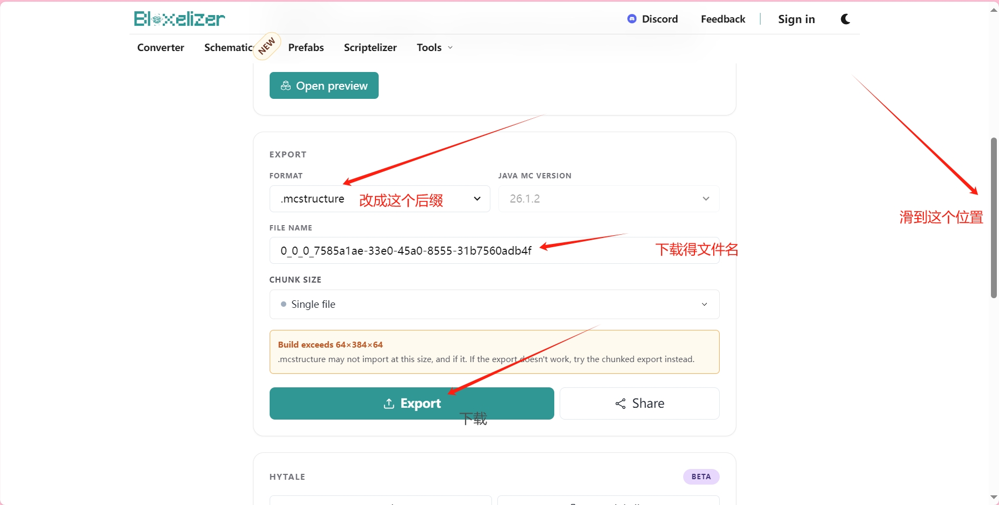

# 蓝图与剪贴板

支持高阶的内部相对结构复制，以及与外部系统的 `.mcstructure` 原生对接。

## 剪贴板 (复制、粘贴与预览)

* **复制结构与基准点：** 复制选区时，系统不仅会打包建筑数据，还会自动将您**当前站立的脚下坐标**作为该结构的「基准点」。这决定了后续粘贴时建筑与您的对齐位置。
* **全息粒子预览：**
  * **精准预填：** 打开面板时，会自动捕获您**准星正对的远端方块**作为预填坐标，实现“指哪打哪”。
  * **放置前预览：** 在执行最终粘贴前，系统会在目标位置生成三维粒子外框。您可以直观地绕着外框走一圈确认占地范围，确认无误后再执行真正的方块覆盖，彻底告别盲目粘贴导致的错位重修。

## 建筑生成引擎 (双模式支持)

在确认放置时，IKBuilder 为您提供了两种截然不同的构建体验：

1. **直接极速生成：** 传统的创世神模式，瞬间完成大规模方块的覆盖，一步到位。
2. **动态 3D 打印模式：** 极具观赏性的渐进式建造模式！
   * **延迟可调：** 您可以在面板中自定义方块放置的延迟时间。引擎将像真正的 3D 打印机一样，逐个、逐层地为您将建筑“打印”出来，带来极强的视觉沉浸感。
   * **动态中断与撤销：** 如果在打印中途发现位置不对，您可以**随时手动中断进程**！中断后，只需使用极速回档连招（手持木斧潜行按 `Q` 键丢弃），即可将已打印的半成品瞬间擦除，零损失回档。

## 线性连环堆叠 (Stack)
在粘贴面板可切换至 Stack 模式，支持向 上/下/东/南/西/北 六个方向，指定次数进行完美无缝拼接铺设，造桥、盖楼、拉围墙只需一键设置循环次数！

---

## 导入与导出

* **导出：** 在面板内一键将当前选区序列化，并保存至服务器后台的 `plugins/IKBuilder/structures` 目录。
* **导入外部蓝图：**
  将外部获取的 `.mcstructure` 文件放入上述目录后，在菜单中选择加载。
  系统会生成绿色粒子外框进行预览。您可以确认、微调坐标，并设置 **0/90/180/270度旋转** 及 **X/Z轴镜像对称** 后，再执行最终生成。

---

## 🌐 推荐获取蓝图的网站

如果您不想自己从零建造，互联网上有海量的大佬已经建好的漂亮建筑。
强烈推荐国内优质的 **[公共蓝图库 (mcschematic.top)](https://mcschematic.top/)**。

在这里，您可以免费搜索并下载到各种国风古建、现代别墅、巨型雕塑的蓝图文件。

---

## 🔄 外部蓝图格式转换 (小白保姆级教程)

**知识普及：** 目前网上（包括公共蓝图库、B站）绝大多数分享的建筑文件，都是 Java 版的投影文件（后缀为 **`.litematic`** ）。而基岩版（以及我们的 IKBuilder）只认 **`.mcstructure`** 格式。

因此，我们需要将下载到的 Java 版投影转换成基岩版结构文件。不用担心，**不需要下载任何软件，手机电脑都能在网页上轻松完成！**

### 详细转换步骤：

**第一步：获取源文件**

前往 [公共蓝图库](https://mcschematic.top/) 或其他平台，下载你心仪的建筑文件（确保后缀是 `.litematic`）。

**第二步：打开在线转换网站**

在浏览器中打开免费在线转换工具 Bloxelizer：👉 [点击访问 Bloxelizer Converter](https://bloxelizer.com/converter)

**第三步：上传并转换**

1. 在网页中点击 `Upload File` (上传文件) 按钮，选择你刚刚下载的 `.litematic` 文件。
2. 网站会自动解析。解析成功后，在下方的导出选项中，确保目标格式选择为 **Bedrock Structure (.mcstructure)**。
3. 点击 **Download** (下载) 按钮。

**第四步：放入服务器**

1. 将下载好的 `.mcstructure` 文件，重命名为你喜欢的英文名字（例如 `my_house.mcstructure`）。
2. 将这个文件通过 FTP 或服务器面板，上传到你服务器的以下目录中：`plugins/IKBuilder/structures/`

**第五步：游戏内导入**

进入游戏，输入 `/ikb` 打开菜单 -> 选择 **[3] 结构导入与导出** -> 选择 **导入外部建筑蓝图**，你就能在下拉列表中看到刚才放入的文件了。生成预览外框调整好位置后，即可执行放置！
